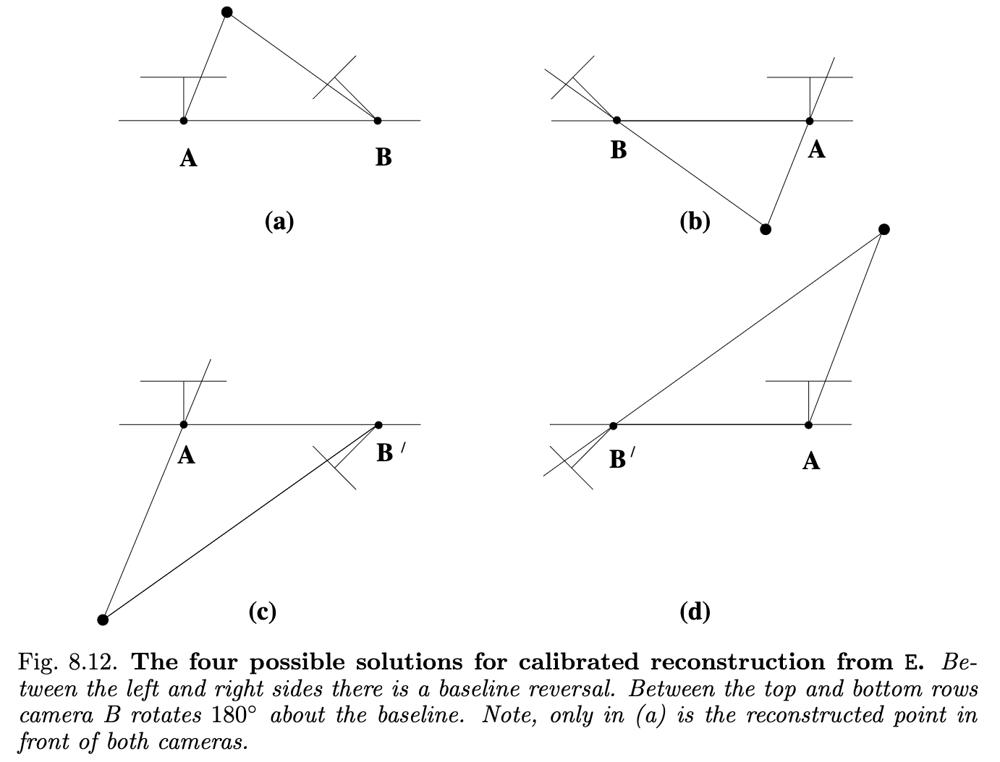
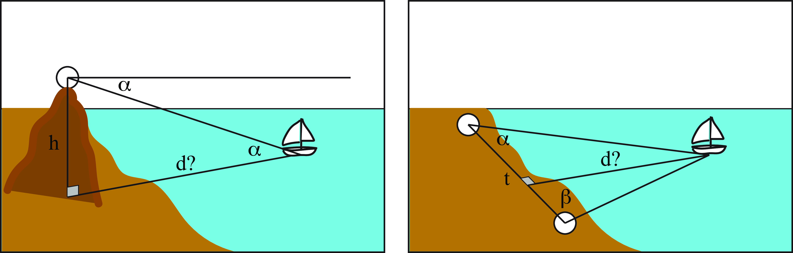

# Notes on SfM
Structure from Motion (SfM) is the process of recovering 3D points and camera poses from
multiple images (as in a moving camera around a scene/object). 
The "Structure" here is the rigid structure of camera poses and 3D points, which we
obtain from -- typically -- a moving monocular camera.

Steps required to do SfM:

1. Feature extraction and matching
2. RANSAC (outlier removal)
3. Fundamental matrix estimation
4. Essential matrix estimation (from the fundamental matrix)
5. Camera pose estimation (from the essential matrix)
6. Check for Cheirality Condition using Triangulation
7. Perspective-n-Point
8. Bundle adjustment

#### What is epipolar geometry?
It is the geometry that relates two cameras observing the same world point W. Epipolar
geometry defines the epipolar plane as the plane defined by the **baseline** (the line
segment between the two camera centers) and the ray from camera center A to world point
X. The epipolar plane thus intersects both image planes at the **epipolar lines** l and
l'. On the **epipolar lines** lie the 2D projections X and X' of W. So we say that X, X'
and W are **coplanar**. The point of intersection of the baseline with the image plane
is called the **epipole**. *All the epipolar lines intersect at the epipole.*
The epipolar geometry therefore constrains the projection of W in the two image planes,
and drastically reduces the search for a match of X (image A) in image B.

#### What is the Fundamental matrix?
F is a 3x3 matrix (rank 2) that is an algebraic representation of epipolar geometry,
i.e.:
$$
{\mathbf{x}^\prime}^{T}F\mathbf{x} = 0
$$
This equation is called the *epipolar constraint*, or the *correspondance condition*, or
even the *Longuet-Higgins* equation. It defines the epipolar line:
$$
l^\prime = F\mathbf{x}
$$
such that points that lie on the line are defined by this single condition:
$$
{x^\prime}^T l^\prime=0.
$$

Since $F\in\mathbb{R}^{3\times 3}$, we can setup a homogeneous linear system with 9
unknowns.

**A correspondence between two image points gives us one linear equation in the unknown
entries of the fundamental matrix F.**
$$
F = \begin{bmatrix}
    f_{11} & f_{12} & f_{13} \\
    f_{21} & f_{22} & f_{23} \\
    f_{31} & f_{32} & f_{33} \\
\end{bmatrix}
$$
So our epipolar constraint ${\mathbf{x}^\prime}^{T}F\mathbf{x} = 0$, where $\mathbf{x} =
\left[x \; y \; 1 \right]^T$ and $\mathbf{x}^{\prime} = \left[x^\prime \; y^\prime \;
1 \right]^T$ simply becomes this
matrix-vector product:
$$
\begin{aligned}
\left[x^\prime \; y^\prime \; 1 \right]
\begin{bmatrix}
f_{11}x + f_{12}y + f_{13} \\
f_{21}x + f_{22}y + f_{23} \\
f_{31}x + f_{32}y + f_{33} \\
\end{bmatrix} &= 0\\

x^\prime x f_{11} + x^\prime y f_{12} + x^\prime  f_{13} 
+ y^\prime x f_{21} + y^\prime y f_{22} + y^\prime f_{23}
+ x f_{31} + y f_{32} + f_{33} &= 0
\end{aligned}
$$

We can rewrite this as a homogeneous system $Af=0$ such that $A$ is the design matrix,
the matrix of row-vectors for the observations, and $f$ is the vector of parameters,
*i.e.* $F$ flattened. The goal here is to find the null space of $A$, *i.e.* $\mathcal{N}
= \{f | Af=0\}$; **we seek a non-zero vector $f$ that satisfies the homogeneous system.**
Now, since this is a **homogeneous system**, then for any *non-trivial* solution $f \neq
0$, any $\lambda f$ is also a solution. This implies that our matrix $A$ has only 8
degrees of freedom, and thus we only need $8$ points to solve it (8 point algorithm).

If we have more than 8 points however, the system becomes overdetermined because of
noise, and there is no exact non-zero solution:
$$
Af\neq0, \quad \forall f \neq 0.
$$
That means our matrix $A$ becomes full rank, $\text{rank}(A) = 9$, and by the
rank-nullity theorem the nullity becomes 0!

To overcome this, we can solve
$$
\min_{||f||=1} ||Af||^2,
$$
*i.e.* find the best approximation of $Af=0$ while avoiding the trivial solution $f=0$.

SVD gives us this best approximate by computing the singular vector corresponding to the
smallest singular value.
SVD solves the *linear least squares* by decomposing the matrix $A$ into $USV^T$
matrices, where $U$ and $V$ are orthonormal matrices and $S$ is a diagonal matrix
containing the singular values.

**Still confused?**

We basically want to solve the homogeneous system $Af=0$, right? But the problem is the
trivial solution is $f=0$. So we constrain the problem as stated above.
In doing so, **we are searching for a direction x that gets mapped as close to zero as possible**.
So we are searching for the approximate null space, and *that's exactly where SVD
helps!*

**Okay so how does SVD solve this, exactly?**
We want to solve
$$
    \min_{||f||=1} ||Af||^2,
$$
and we can reformulate $||Af||$ as
$$
\begin{align}
    ||Af|| &= ||U\Sigma V^T f|| \\
        &= ||\Sigma V^T f||, \quad \text{since} \quad ||U\mathbf{x}|| = ||\mathbf{x}|| \quad \text{(orthonormal matrix)}
\end{align}
$$
Now if we define $y = V^T f$, then due to $V$ also being orthonormal,
$$
\begin{align}
||y|| &= ||V^T f|| \\
        &= ||f||.
\end{align}
$$
So now the minimization becomes
$$
    \min_{||y||=1} ||\Sigma y||^2,
$$
and because $\Sigma$ is diagonal, 
$$
||\Sigma y||^2 = \sum_i \sigma_i^2 y_i^2.
$$
We can minimize this by **placing all the weight on the smallest singular value**,
simply taking the smallest value $\sigma_i$, *i.e.* the last
diagonal value of $\Sigma$ which corresponds to the smallest right singular value in
$V^T$:
$$
f = (V^T)^{-1} y = V y
$$
since $V^T$ is a square orthonormal matrix.

**Now that we have F, how do we use it?**
The Fundamental matrix defines the epipolar line in image B for any point in image A
$$
l^B = F \mathbf{x}_A,
$$
and conversely in image A for any point in image B:
$$
l^A = F^T \mathbf{x}_B.
$$

What $F$ gives us is a powerful way of rejecting outliers, as there will be quite a lot,
by checking for the epipolar constraint, such that
$$
\mathbf{x}^BF\mathbf{x}^A ~= 0,
$$
*i.e.* the matched point $\mathbf{x}^B$ lies closely to its epipolar line.
So with $F$ we can apply RANSAC to remove all outliers, and thus proceed the
reconstruction with **robust and geometrically valid matches**.

##### Side notes on the Fundamental matrix
The fact that it's rank 2 is actually a necessity. It means $\text{nullity}(F)=1$, which
is necessary to find the null-space
$$
Fe=0,
$$
*i.e.* the epipole. **The epipole must map to 0**, and all epipolar lines pass through
it.

$\text{det}(F)=0$ so $F$ is singular, and thus cannot be bijective unlike the
hommography matrix $H$, such that $\mathbf{x}^\prime=H\mathbf{x}$ and
$\mathbf{x}=H^{-1}\mathbf{x}^\prime$. But then how can
$l=F^T\mathbf{x}^\prime$ if $l^\prime=F\mathbf{x}$?

The reason is that epipolar geometry is symmetric between the two cameras (analogous to
dual spaces), and thus the input and output variables can be swapped, resulting in the
transpose of $F$.

#### Estimating camera matrices from the Fundamental matrix
$F$ only depends on projective properties of the cameras $P$,$P^\prime$; it is only a
linear mapping of the *projective camera between world and image points*. The
relationship described by $F$ **does not depend on Euclidean measurements such as the
angle between rays**.

The camera matrix (such as $P=K[R|\mathbf{t}]$) relates 3D space measurements to image
measurements and so depends on: (a) the image coordinate frame and (b) the choice of
world coordinate frame. $F$ does not: *the fundamental matrix is unchanged by a
projective transformation of 3-space.* Thus, although a pair of camera matrices ($P$,
$P^\prime$) uniquely determines a fundamental matrix $F$, the converse is not true.
**$F$ determines the pair of camera matrices at best up to right-multiplication by a 3D
projective transformation.**
Given this ambiguity, it is common to define a specific *canonical form* for this pair
that corresponds to one $F$.

**Canonical form of camera matrices.** We can simply represent the first camera as
$[I|\mathbf{0}]$ where $I\in \mathbb{R}^{3\times 3}$ is the identity and $\mathbf{0}$ is
a null 3D vector.

--> The only ambiguity in estimating camera matrices lie in the fact that **pairs of
camera matrices that differ by a projective transformation give rise to the same
fundamental matrix.** Thus, $F$ captures the projective relationship of two cameras.

##### Canonical cameras given $F$
We can derive the formula for a pair of cameras with canonical form given $F$!
First of all, the condition is that for a pair of camera matrices $P$ and $P^\prime$,
${P^\prime}^TFP$ must be skew-symmetric.
The condition that ${P^\prime}^T F P$ is skew-symmetric is equivalent to $X^T
{P^\prime}^TFPX=0$ for all $X$.
Then, let $F$ be a fundamental matrix and $S$ any skew-symmetric matrix. Define the pair
of camera matrices
$$
P=[I|\mathbf{0}] \; \text{and} \; P^\prime=[SF|\mathbf{e}^\prime]
$$
where $\mathbf{e}^\prime$ is the epipole such that $\mathbf{e}^\prime F=0$. Then $F$ is
the fundamental matrix of the pair ($P$, $P^\prime$).

**Yeah but what's $S$??** A good choice of $S$ is $S=[\mathbf{e}^\prime]_\times$, which
is the *skew-symmetric cross-product matrix* associated with the vector $\mathbf{e}^\prime$.
This matrix is defined so that for any vector $v$,
$$
[e^\prime]_\times v ={e^\prime} \times v,
$$
where $\times$ is the ordinary 3D vector cross product.

**But the most general solution is in fact:**
$$
P=[I|\mathbf{0}] \quad P^\prime = [[\mathbf{e}^\prime]_\times F + \mathbf{e}^\prime
\mathbf{v}^T | \lambda \mathbf{e}^\prime]
$$
where $\mathbf{v}$ is any 3-vector and $\lambda$ is any non-zero scalar.

#### What is the Essential matrix?
It is the specialization of the fundamental matrix to the case of normalized image
coordinates. Basically, the fundamental matrix is the more general form where we removed
the inessential assumption of calibrated cameras. So the essential matrix naturally has
fewer degrees of freedom, and it has several properties.

**Normalized coordinates**
If we consider $P=K[R|\mathbf{t}]$ and let $x=PX$ be an image point, then, if we know
$K$, we can inverse $x$ to obtain $\hat{x}=K^{-1}x$. So then $\hat{x} =
[R|\mathbf{t}]X$, where $\hat{x}$ is the image point expressed in *normalized
coordinates.* We can think of it as the image of $X$ with respect to a camera having the
identity matrix as calibration matrix, so $K^{-1}P = [R|\mathbf{t}]$ is called a
*normalized camera matrix* (we have removed the effect of knowing the calibration matrix).
We call this matrix the essential matrix
$$
E = [\mathbf{t}]_\times R = R [R^T \mathbf{t}]_\times, with
$$
$$
{\hat{\mathbf{x}}^\prime}^TE\hat{\mathbf{x}}=0
$$
and
$$
E={K^\prime}^TFK.
$$

**Scale ambiguity**
Like the fundamental matrix, the esential matrix is a homogeneous quantity.

#### Extraction of cameras from the essential matrix
We can compute $E$ directly from the normalized image coordinates via
$$
{\hat{\mathbf{x}}^\prime}^TE\hat{\mathbf{x}}=0,
$$
or from the fundamental matrix using
$$
E={K^\prime}^TFK.
$$
Note that in both cases, we need to know the projection matrix $K$, without which we
cannot get the normalized image coordinates ${\hat{\mathbf{x}}^\prime} \; \text{and}
\; \hat{\mathbf{x}}$.

Once it is known, the camera matrices may be retrieved from $E$ up to scale and a
four-fold ambiguity, unlike using the fundamental matrix where there is a projective
ambiguity. So we have four possible solutions, except for overall scale which cannot be
determined. *Since we operate in normalized image coordinates and removed the assumption
of a calibrated camera, what we recover here is the camera pose.*

1. Assume the first camera matrix is $P=[I|\mathbf{0}]$.
2. To compute the second one $P^\prime$, it is necessary to factor $E$ into the product
   $SR$ of a skew-symmetric matrix and a rotation matrix.

Since we know that we can factor $E$ as $E=SR$, and that the $SVD$ of $E$ is
$U\text{diag}(1,1,0)V^T$, then there are two possible factorizations:
$$S=UZU^T \quad R=UWV^T \quad \text{or} \quad UW^TV^T$$
This determines the $\mathbf{t}$ part of $P^\prime$ (up to scale) from
$S=[\mathbf{t}]_\times$. Since the Frobenius norm of $S$ is 2, $||\mathbf{t}||=1$, which
is a convenient normalization for the baseline of the two camera matrices.
Since $S\mathbf{t}=\mathbf{0}$, it follows that $\mathbf{t}=U(0,0,1)^T=\mathbf{u}_3$,
the last column of $U$. However, **the sign of $E$, and consequently $\mathbf{t}$,
cannot be determined.** Thus, there are **four possible choices of the camera matrix
$P^\prime$**, based on the two possible choices of $R$ and two possible signs of
$\mathbf{t}$:
$$
P^\prime = [UWV^T|+\mathbf{u}_3] \quad \text{or}
P^\prime = [UWV^T|-\mathbf{u}_3] \quad \text{or}
P^\prime = [UW^TV^T|+\mathbf{u}_3] \quad \text{or}
P^\prime = [UW^TV^T|-\mathbf{u}_3].
$$

From this diagram, we can clearly see that $X$ will be in front of both cameras in one
of the four solutions only. Thus, testing with a single point to determine if it is in
front of both cameras is sufficient to decide between the four solutions for $P^\prime$.

#### What is Cheirality?
To find the correct camera pose, we only need to check whether the reconstructed point
lies in front of both cameras. This can be done by triangulating the 3D points (given
our pair of camera poses) using **linear least squares** to check the sign of the depth
variable in the camera coordinate w.r.t. camera center.

A 3D point $X$ is in front of the camera if and only if:
$$
r_3(X-C)>0
$$
where $r_3$ is the third row of the rotation matrix (the z axis).

Since we have noise in the point correspondences, this condition won't be satisfied by
all points. Therefore we select the best camera configuration via majority voting on the
cheirality condition.

### Point triangulation
To check the cheirality condition, we must first triangulate the 3D points given the
pair of camera poses using linear least squares. But first of all, what is
triangulation?

Triangulation is the estimation of a 3D point from multiple observations, ie the
distance of a point from a line segment which defines two right triangles and thus
requires two observation points. This is illustrated in the following diagram as solving
for $d$ via
$$
d=t\frac{\sin(\alpha)\sin(\beta)}{\sin(\alpha+\beta)}
$$

Conveniently, we can view the two camera centers and the epipolar line as the basis for
our triangle pointing at $X$, and as such we can triangulate points. However, since we
need to account for the perspective transformation $\hat{x}=KPX$, we need an extra step.
We can in fact triangulate our two image observations via the inhomogeneous linear
system
$$
AX=\hat{X}
$$
where $A=K[R|\mathbf{t}]$. This inhomogeneous linear system can be solved via linear
least squares for the entire set of observed points in normalized image coordinates
$\mathbf{X} \in \mathbb{R}^{N\times 3}$.

#### What is Perspective-n-Point (PnP)?

Once we obtained 3D points for an image pair using triangulation and the cheirality
condition, the pose that we obtain is only up to scale, i.e. $||t||=1$. The problem is
that we would need to chain up the operation for each image pair to obtain all camera
poses, but they wouldn't be in a global frame due to this scale ambiguity caused by the
Essential matrix. Eventually, the scale ambiguity and pose estimate errors would
accumulate and lead to bad drift.

To remedy this, we instead solve the camera pose of each new image in the global frame
using PnP. By anchoring each new camera into an already known 3D structure, we prevent
drift and error accumulation (similar to loop closure in SLAM).

Before applying PnP to optimize the global pose of each camera, we need to bootstrap the
known 3D structure. This is the whole pipeline:
1. Bootstrap with two frames:
    - Essential matrix estimation
    - Triangulation (DLT)
    - Pose prediction
2. For each new frame:
    - Match features to the 3D point cloud via correspondances with
   earlier frames
    - Apply linear PnP for init (DLT triangulation implemented above)
    - Refine with non-linear PnP
    - Triangulate new points between i-1 and i
    - Optionally, local bundle adjustment
3. Global bundle adjustment

#### What is bundle adjustment?

#### What about dense SfM?
Dense SFM approaches usually optimize photometric error, that is, the difference in
grayscale or red-green-blue (RGB) intensities of corresponding pixels across images.
This is in contrast to the point feature-based methods we looked at in this chapter that
minimize a 3D reprojection error. However, these dense SFM techniques tend to be much
slower than the sparse SFM methods, and often require more assumptions about the scene
or the images, such as the scene being Lambertian (i.e., the grayscale or RGB intensity
of a 3D point is invariant to the viewing direction) or the images having a
substantially smaller baseline motion compared to the range of motions a point
feature-based SFM approach can handle.

